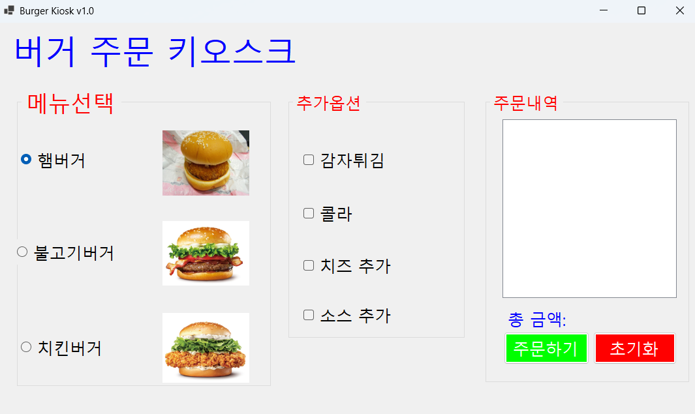
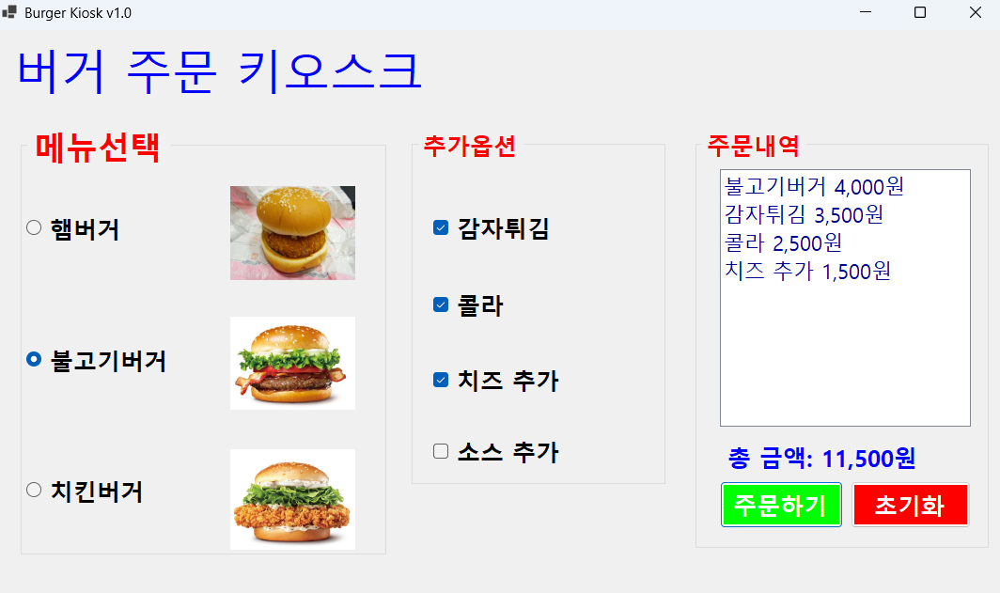
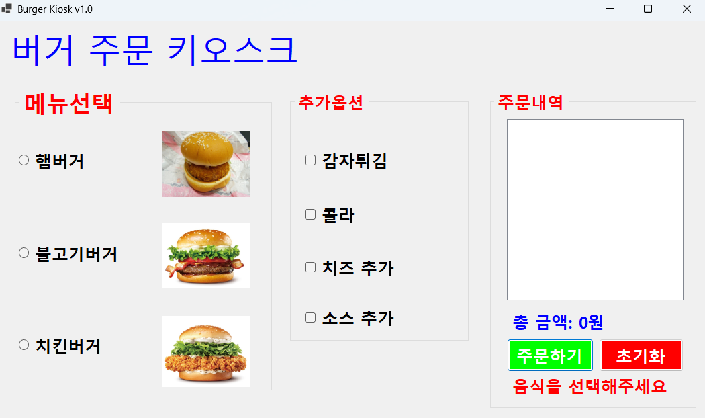
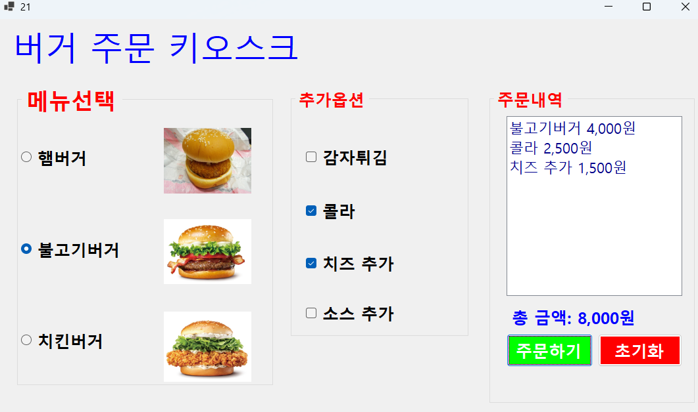
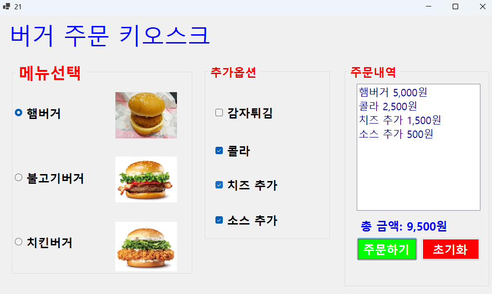

# (C# 코딩) 로그인 화면
## 개요
- C# 프로그래밍 학습
- 1줄 소개: 음식점에서 주로 사요하는 키오스크 구현
- 사용한 플랫폼: 
- C#, .NET Windows Forms, Visual Studio, GitHub
- 사용한 컨트롤:
- CheckBox, RadioButton, Label, Button, GroupBox
- 속성: Checked, Text, Enabled
- 메서드: ToString(), Clear()
- 이벤트: Click
- 사용한 기술과 구현한 기능:
- Visual Studio를 이용하여 UI 디자인
- 메뉴 선택 기능: RadioButton을 활용한 단일 메뉴 선택
- 옵션 선택 기능: CheckBox를 활용한 복수 선택 처리
- 가격 계산 기능: 선택된 항목들의 가격을 합산
- 이벤트 처리: 버튼 클릭 시 전체 로직 실행
- 조건문 활용: 선택 여부에 따른 분기 처리
- UI 업데이트: 사용자 입력에 따라 화면 즉시 반영
## 실행 화면 (과제1)
- 과제1 코드의 실행 스크린샷

- 과제 내용
- 기본적인 키오스크 컨트롤 배치와 기본적인 속성 설정
- 선택된 항목 추출 기능 구현
- RadioButton과 CheckBox 등을 알맞은 곳에 배치
- GroupBox로 항목 연결
- 주문하기 버튼을 누를 시 Radiobutton에서 선택된 상품과 CheckBox에서 선택된 상품의 계산 결과가 listBox에 도출된다.
- 초기화 버튼을 누를 시 지금까지 계산된 결과가 모두 초기화된다.

## 실행 화면 (과제2)
- 과제2 코드의 실행 스크린샷

- 과제 내용
- 아무것도 선택하지 않고 주문 시 숨겨져있던 Label 메세지가 나타나게 됨
- //Visible을 true와 false로 바꾸어 속성을 변환시킴

## 실행 화면 (과제3)
- 과제3 코드의 실행 스크린샷

- 과제 내용
- 키보드로만 음식을 주문할 수 있게 구현
- GroupBox에 있는 첫 번째 checkbox들만 tapstop을 true로 바꾸고 나머지 값들을 false로 바꾸어서 tab을 했을 때 다음 groupbox의 맨 위에있는 상품에
  포커스가 집중되도록 함
- 탭 순서를 변경해 햄버거->추가 메뉴-> 주문,초기화 단계로 넘어가도록 설정
- 초기화를 한 후 다시 햄버거부터 선택할 수 있도록 focus를 햄버거로 설정

## 실행 화면 (과제4)
- 과제4 코드의 실행 스크린샷

- 과제 내용
- RadioButton과 CheckBox에서 원하는 항목을 선택하면 그 즉시 정보들이 업데이트 되도록 만들기
- 햄버거와 사이트 매뉴의 checked 항목을 handler로 묶어서 처리

이 프로젝트의 핵심인 이벤트 핸들러 통합 로직입니다.

// 모든 컨트롤의 상태 변화를 하나의 핸들러로 묶어 관리
EventHandler handler = (s, ev) => 

{

    if (s is RadioButton rb && !rb.Checked) return;
    UpdateOrder(); // 실시간 UI 갱신 로직 호출

};

rdoHamBurger.CheckedChanged += handler;

chkCola.CheckedChanged += handler;

// ... (이벤트 연결 코드)